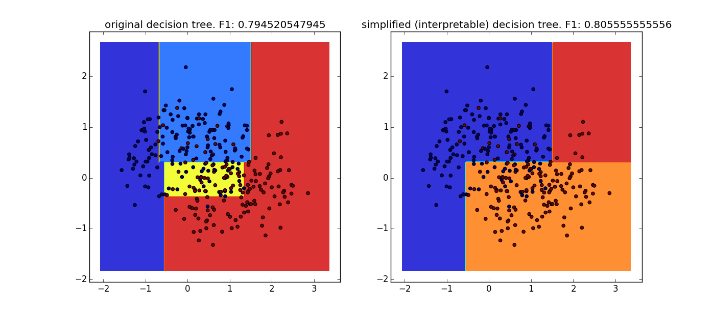

Highly interpretable, sklearn-compatible classifier and regressor based on simplified decision trees
===============

Implementation of a simple, greedy optimization approach to simplifying decision trees for better interpretability and readability. 

It produces small decision trees, which makes trained classifiers **easily interpretable to human experts**, and is competitive with state of the art classifiers such as random forests or SVMs.

Turns out to frequently outperform [Bayesian Rule Lists](https://github.com/tmadl/sklearn-expertsys) in terms of accuracy and computational complexity, and Logistic Regression in terms of interpretability.
Note that a feature selection method is highly advisable on large datasets, as the runtime directly depends on the number of features. 

Usage
===============

The project requires [scikit-learn](http://scikit-learn.org/stable/install.html).

The included `InterpretableDecisionTreeClassifier` and `InterpretableDecisionTreeRegressor` both work as scikit-learn estimators, with a `model.fit(X,y)` method which takes training data `X` (numpy array or pandas DataFrame) and labels `y`.

Tree size and complexity can be reduced by two parameters: 
* the classical [`max_depth' parameter](http://scikit-learn.org/stable/modules/generated/sklearn.tree.DecisionTreeClassifier.html#sklearn.tree.DecisionTreeClassifier), and
* the `acceptable_score_drop' parameter, which specifies the maximum acceptable reduction in classifier performance (higher means more branches can be pruned). By default, the F1-score is used for this purpose. A `scorer' parameter can be passed to the `fit' method if optimization based on other scores is preferred. 

Comparison with other sklearn classifiers (can be reproduced with `run_demo_classifier_comparison.py'. Rule List Classifier: see [here](https://github.com/tmadl/sklearn-expertsys))

```python
                       D.Tree3 F1          D.Tree5 F1            Interpr.D.Tree3 F1      Interpr.D.Tree5 F1     RuleListClassifier F1   Random Forest F1      
==========================================================================================================================================================
diabetes_scale        0.814 (SE=0.006)    0.808 (SE=0.007)        0.826 (SE=0.005)       *0.833 (SE=0.005)      0.765 (SE=0.007)        0.793 (SE=0.006)
breast-cancer         0.899 (SE=0.005)    0.912 (SE=0.005)        0.920 (SE=0.004)        0.917 (SE=0.004)      0.938 (SE=0.004)       *0.946 (SE=0.004)
uci-20070111 haberman 0.380 (SE=0.020)    0.305 (SE=0.019)        0.380 (SE=0.020)       *0.404 (SE=0.015)      0.321 (SE=0.019)        0.268 (SE=0.017)
heart                 0.827 (SE=0.005)    0.800 (SE=0.005)        0.824 (SE=0.005)       *0.828 (SE=0.006)      0.792 (SE=0.006)        0.808 (SE=0.008)
liver-disorders       0.684 (SE=0.013)    0.610 (SE=0.017)       *0.702 (SE=0.014)        0.670 (SE=0.016)      0.663 (SE=0.019)        0.635 (SE=0.016)
'''

The learned rules of a trained model can be displayed simply by casting the object as a string, e.g. `print model`, or by using the `model.tostring(feature_names=['feature1', 'feature2', ], decimals=1)` method and specifying names for the features and, optionally, the rounding precision. 

```python
# Data from https://archive.ics.uci.edu/ml/datasets/Breast+Cancer+Wisconsin+(Diagnostic)
def breast_cancer_probability(radius, texture, perimeter, area, smoothness, compactness, concavity, concave_points, symmetry, fractal_dimension):
  if perimeter <= 2.5:
    if concavity <= 5.5: return 0.012
    else: return 0.875
  else:
    if area <= 2.5: return 0.217
    else: return 0.917
'''

Self-contained usage example:

```python
import numpy as np
from sklearn.datasets.samples_generator import make_moons
from sklearn.model_selection._validation import cross_val_score
from InterpretableDecisionTreeClassifier import *

X, y = make_moons(300, noise=0.4)
print("Decision Tree F1 score:",np.mean(cross_val_score(DecisionTreeClassifier(), X, y, scoring="f1")))
print("Interpretable Decision Tree F1 score:",np.mean(cross_val_score(IDecisionTreeClassifier(), X, y, scoring="f1")))

"""
**Output:**
Decision Tree F1 score: 0.81119342213567125
Interpretable Decision Tree F1 score: 0.8416950113378685
"""
```

